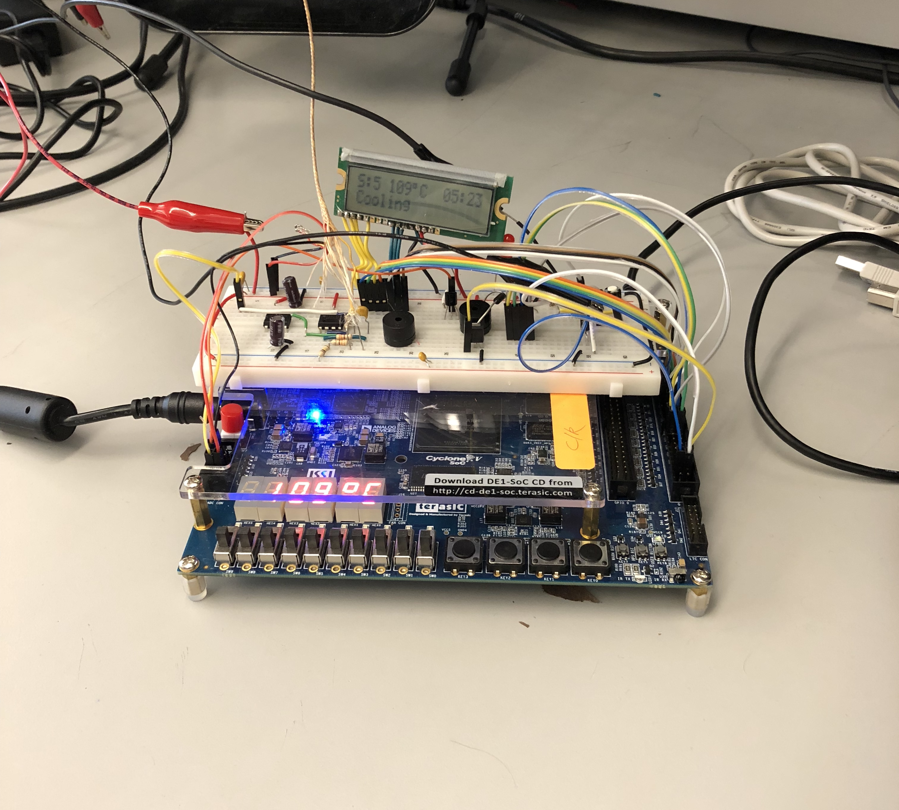

## Solder Reflow Oven Controller

A reflow oven is a machine used primarily for reflow soldering of surface mount electronic components to printed circuit boards (PCB). My team developed a controller for a reflow oven using an 8052 soft processor, thermocouple wire, analog-digital converter, and finite state machine programmed in Assembly language. We also logged and graphed the temperature reading in real-time using Python via serial peripheral interface, and used a Python API to send text messages to the operator of the oven, providing updates throughout the reflow process.

Team members: Joshua Marangoni, Justin Scott, Ebi Sadeghi, Henry Bryant, Yousof Al-Autman, Robert Migut

   
  

